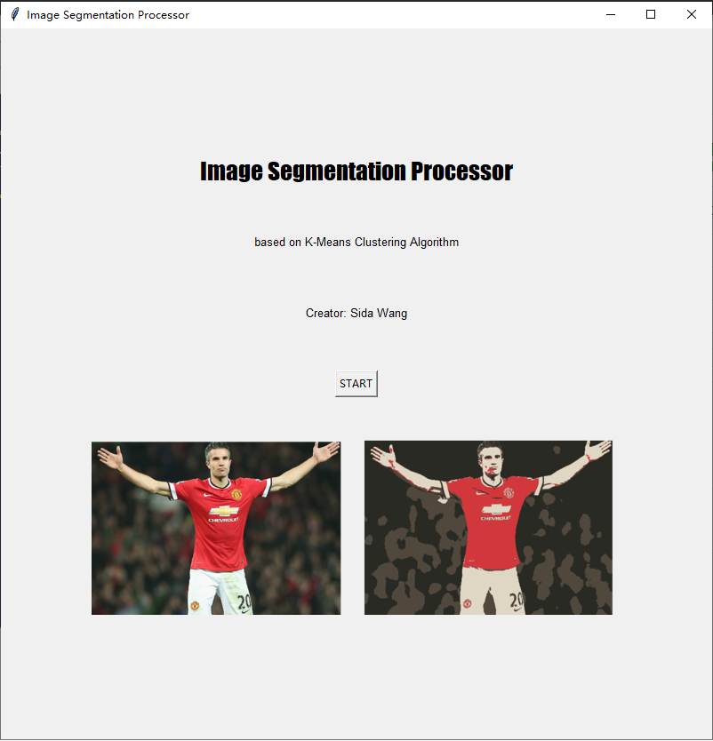
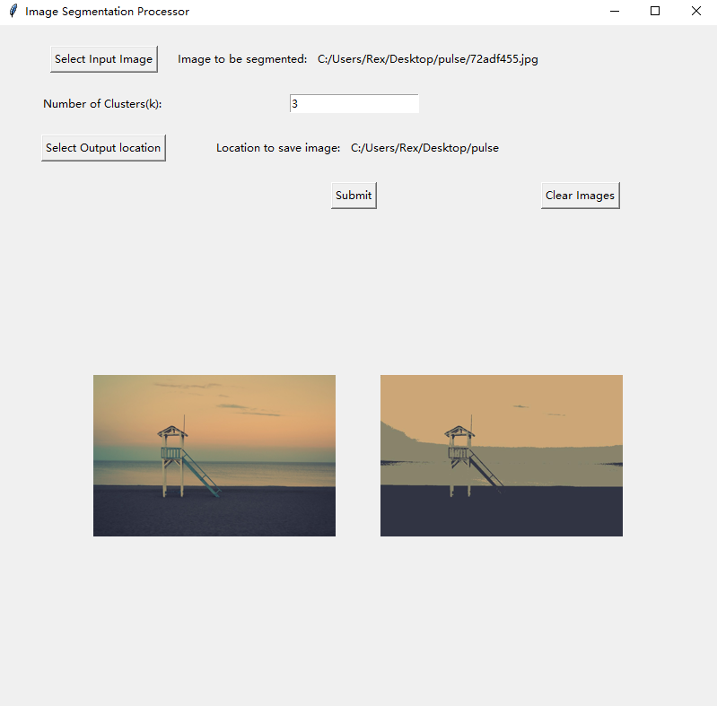

# Image Segmentation Program
Small **Python** program performing image segmentation using **k-means clustering algorithm**

### Supported Image Types
- **JPEG(.jpg)**
- **PNG(.png)**

### External Python Libraries
- **Scikit-Learn & Scikit-Image**
  - Basic usage of k-means algorithm and image image loading.
- **Numpy**
  - Matrix operations
- **Pillow(PIL)**
  - Image convert
- **Tkinter**
  - GUI
### Run the Program
- This can be done in **Windows PowerShell** or **Linux/Mac Terminal**, and it requires **git**, **python**, **Numpy**, **PIL**, **Tkinter** and **Scikit**, or at least **pip**.
- The instruction of how to install **python** can be found at [**HERE**](https://www.python.org/downloads/).
- The instruction of how to install **pip** can be found at [**HERE**](https://pip.pypa.io/en/stable/installing/).
- The instruction of how to install **git** can be found at [**HERE**](https://git-scm.com/book/en/v2/Getting-Started-Installing-Git).
- To install **numpy**(it requires pip to be installed), run:
```shell
pip install numpy
```
- To install **PIL**(it requires pip to be installed), run:
```shell
pip install Pillow
```
- To install **Scikit**(it requires pip to be installed), run:
```shell
pip install -U scikit-learn
```
and
```shell
pip install scikit-image
```
- To start the program, sequentially run:
```shell
git clone https://github.com/RexWangSida/CraftMaster.git
```
```shell
cd CraftMaster/CraftMasterGame/src
```
```shell
python main.py
```
## GUI
<div align='center'></img></div>
<div align='center'></img></div>
